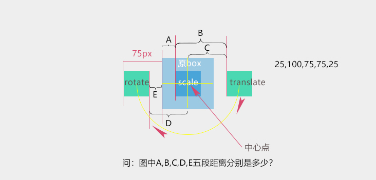

# transform 后面的各个函数的执行顺序问题

```html
<style>
*{margin:0;padding:0;}
#box{width:100px; height:100px;transform:rotate(180deg) translateX(100px) scale(0.5)}
</style>
<div id="box"></div>
```



---

3D 中：

perspective 必须初始化

会触发多次 根据属性来算的

事件 transitionend ：判断运动完成
