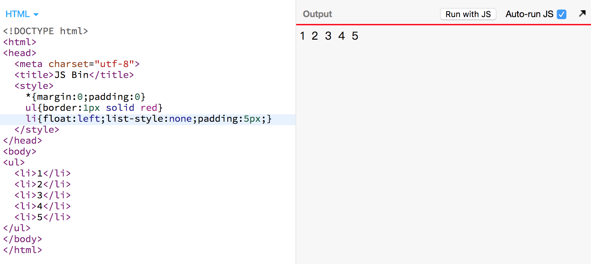

# 只需用 HTML、CSS 就可以写页面了

## HTML

HTML 的话，只要熟悉 html 标签的意思，一般就是单词意思，就能所谓的语义化的结构。

如果是在很久以前，还没有 css 的时候，那就是看文章，用浏览器给他们的生成的自带样式也就够了，可是现在的网页布局很“复杂”，所以就要学会 css。
css 的学习就是背单词而已，真的，背会了，简简单单的页面就可以做出来了，但是还有一些奇怪的问题要注意，因为可能在你写样式的时候，就两两一配合，然后我就可以恭喜你了，问题出来了，O(∩_∩)O 哈哈~

## CSS中的一些词

- 选择器：就是为了选中元素发明的
- 媒体查询：link 标签 `media`属性、`@media (max-width: 600px) {}`
- 文档流（Normal Flow）
- 盒模型

## 常见 CSS 问题

### 1. 浮动的时候，父元素高度塌陷

[demo链接]('./problem/浮动_高度塌陷.html')

### 2. 元素的 `margin` 会在某些情况下，上下方向会合并

图片显示的不是很直观，审查元素看看。

[demo链接]('./problem/margin合并.html')

### 3. CSS的优先级

### 4. 如何能触发 bfc 现象

### 5. CSS 中的，哪些属性触发回流，哪些属性触发重绘

### 6. 子元素固定定位+父元素添加 transform 属性：固定定位失效，变成绝对定位

### 7. 布局：定位布局、浮动布局、flex 布局、grid 布局

- 左右布局
- 左中右布局
- 水平居中
- 垂直居中

### 8. 计算：`line-height`

### 9. 响应式

### 10. 内联元素（包括 inline-block）：都要使用`vertical-align`，值可以是任意一个

内联元素之间有任何看不见的字符（回车、空格），都会转为 1 个空格（试试用浮动代替）

### 11. position+float：他们之间有个不在起作用

### 11. 何时直接定宽高，何时要用其他属性把容器撑开

### 12. 一比一的 div

### 13. input top border disappears in windows chrome

[需要梯子才能看](https://stackoverflow.com/questions/42151075/input-top-border-disappears-in-windows-chrome)

### 14. 元素设置overflow之后内部元素的定位问题

---

CSS就是你要什么功能，我就加什么属性。

- 你要颜色，就有 color: red; background-color: red;
- 你要图文混排，就有 float: left
- 你要绝对定位，就有 position: absolute

CSS 不正交，因而有些反直觉。不正交主要表现在两点：

- 各属性之间互相影响
  - margin V.S. border、display:block、display:flex
    - 
    - border、padding、 display:inline-block|flex|table、overflow:hidden
    - 

  - 小圆点 V.S. display
    - position: absolute V.S. display: inline
- 各元素之间互相影响
  - position: fixed V.S. transform
  - float 影响 inline 元素（只影响文字，容器没影响）

## CSS 学习的易点

### 背套路即可应付日常工作

- 水平居中
- 垂直居中：避免 parent 容器的高度固定

### 巧用工具

- CSS 3 Generator

---

## 文档流（Normal Flow）

- 内联元素的宽高
  - 字体的行高是由设计师决定的，所以不同字，默认行高不同
- 块级元素的宽高
  - 高度：由内部文档流总和决定（是决定，不是相等）的（如果只有文字，那就是 line-height\*行数）
  - div 的宽度，不是由文字决定的。默认就好，根据父级宽度。
- 水平居中
- 垂直居中：flex
- 文字溢出省略（多行）

文字垂直居中：padding+适当的 line-height

- outline
- border 调试大法
