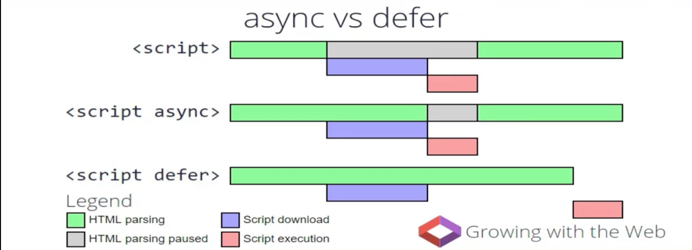

# 关键路径渲染

## 浏览器渲染原理

* DOM
* CSSOM
* RenderTree
* Layout
* Paint

### 文档对象模型 (DOM)


* 转换： 浏览器从磁盘或网络读取 HTML 的原始字节，并根据文件的指定编码（例如 UTF-8）将它们转换成各个字符。
* 令牌化(Token)： 浏览器将字符串转换成 W3C HTML5 标准规定的各种令牌，例如，“<html>”、“<body>”，以及其他尖括号内的字符串。每个令牌都具有特殊含义和一组规则。
* 词法分析（Node）： 发出的令牌转换成定义其属性和规则的“对象”(我理解成标签)。
* DOM 构建： 最后，由于 HTML 标记定义不同标记之间的关系（一些标记包含在其他标记内），创建的对象链接在一个树数据结构内，此结构也会捕获原始标记中定义的父项-子项关系：HTML 对象是 body 对象的父项，body 是 paragraph 对象的父项，依此类推。

**`注：DOM 是增量构建，没有必要等到 DOM 构建完成之后在渲染到页面`**

### CSS 对象模型 (CSSOM)


与 DOM 的流程类似，只不过它是 CSSOM


上图说明 CSSOM 为啥是树形结构

### 构建渲染树 Render Tree


* 从 DOM 树的根节点开始遍历每个可见节点。
  * 某些节点不可见（例如脚本标记、元标记等），因为它们不会体现在渲染输出中，所以会被忽略。
  * 某些节点通过 CSS 隐藏，因此在渲染树中也会被忽略，例如，上例中的 span 节点---不会出现在渲染树中，---因为有一个显式规则在该节点上设置了“display: none”属性。
  * 节点位置和大小是基于 viewport 计算的
* 对于每个可见节点，为其找到适配的 CSSOM 规则并应用它们。
* 发射可见节点，连同其内容和计算的样式。
* 最终输出的渲染同时包含了屏幕上的所有可见内容及其样式信息

**`注：简单提一句，请注意 visibility: hidden 与 display: none 是不一样的。前者隐藏元素，但元素仍占据着布局空间（即将其渲染成一个空框），而后者 (display: none) 将元素从渲染树中完全移除，元素既不可见，也不是布局的组成部分。`**

总结：

* 到目前为止（以上 3 步骤），我们计算了哪些节点应该是可见的以及它们的计算样式，但我们尚未计算它们在设备视口内的确切位置和大小---这就是“布局”阶段 Layout，也称为“自动重排”。
* Render Tree 会等到 CSSOM 构建完在执行，因为 css 是增量构建，但不是增量渲染的。浏览器不能先渲染 14px 字，又接着渲染 18px，发现又变量，渲染成 16px

### 布局阶段 Layout：计算渲染树的位置和大小

为弄清每个对象在网页上的确切大小和位置，浏览器从渲染树的根节点开始进行遍历。

执行渲染树构建、布局和绘制所需的时间将取决于文档大小、应用的样式，以及运行文档的设备：文档越大，浏览器需要完成的工作就越多；样式越复杂，绘制需要的时间就越长（例如，单色的绘制开销“较小”，而阴影的计算和渲染开销则要“大得多”）。

查看哪些样式触发 Layout：[https://csstriggers.com/](https://csstriggers.com/)

* 屏幕旋转
* 浏览器视窗改变
* 与大小位置相关的 CSS 属性改变

### 最后 Paint

布局完成后，浏览器会立即发出“Paint Setup”和“Paint”事件，将渲染树转换成屏幕上的像素(，也就是填充)

## 资源对渲染的影响

* img
* css
* js
* font

### CSS 资源

浏览器会在何时渲染页面：加载完部分 DOM 和 CSSOM

```html
<style></style>
<link />
```

* 上面 2 种形式都会阻止初次渲染
* 浏览器会在解析完 CSS 后，在进行渲染，为了防止样式突变带来的抖动
* 不管 CSS 出现在文档哪里，都会阻塞整个文档初次渲染
* 通过 link 标签，阻塞时间更长，因为有个网络请求时间

重点：关键资源

* document.write 写入 link 标签，阻止渲染
* css 是不是关键资源，看媒体查询
  * 如果不是当前网页所应用的类型文件，虽然也会加载，但是不会阻塞初次渲染
* 通过 DOM api 添加 link 不会阻塞渲染
* `<link rel="preload" href="xxx" onload="this.rel='stylesheet'">`

### JS 资源

* JS 阻塞 HTML 渲染
  * 因为 js 有修改 dom 的能力，所以浏览器会在执行 js 期间，暂停 html 渲染
* CSS 阻塞 JS
  * 因为 JS 能读取或者修改 CSS，所以要等到 CSS 加载完在执行
* 当 HTML 被 JS 阻塞了，虽然停止构建 DOM，但是浏览器还是会识别 JS 后面的资源，并提前加载他们，
  * 这是浏览器的资源加载策略

重点：关键资源

#### 不是关键资源

* 放到底部，‘延时’加载
* 使用 defer 延迟脚本执行。拥有 defer 的脚本，会被推迟到 HTML 文档解析完成后，在执行；并且执行的顺序是按照 HTML 文档中出现的顺序。
  * 不会阻塞初次渲染
  * 放的越前面，越能提前加载
  * 不好的地方：执行顺序。如果前面加载 1M 的 js 文件，这个不加载完，后面的就算加载完也执行不了
* 使用 async 异步加载脚本
  * 不会阻塞初次渲染，也不会被 CSS 阻塞
  * 脚本加载完就执行，所以跟在 HTML 文档中的顺序无关
  * 适用于无依赖的 js



### 字体

* 阻塞初次渲染，页面空白。所以要异步加载 css，因为字体是定义在 css 里的

### 图片：不会阻塞

## 优化关键渲染路径

目标：以下压缩到最低

* 关键资源数
* 关键资源体积
* 关键资源网络来回数

---

* 延迟或异步加载资源，从而减少关键资源数
* 减小资源大小
* 针对关键资源，减少网络请求时间

## 构建 DOM 是增量构建

浏览器无需等待 HTML 加载完毕，就开始构建 DOM

## 使用 Timeline 注意事项

* 禁用缓存（Network 里 Disable cache），以便测试首次浏览性能
* 关闭 Chrome 扩展或者直接使用隐身模式
* 模拟真实网络情况
* Chrome Canary(Chrome 开发版本)
